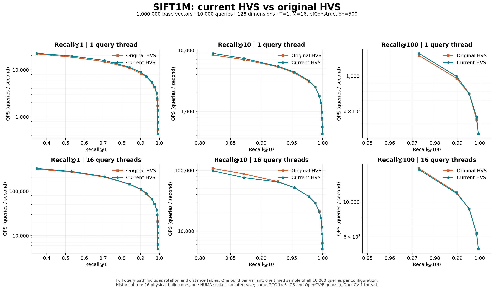
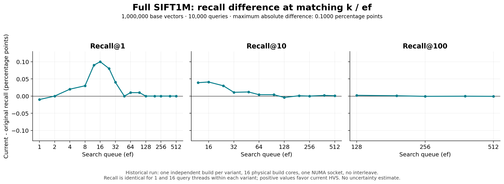
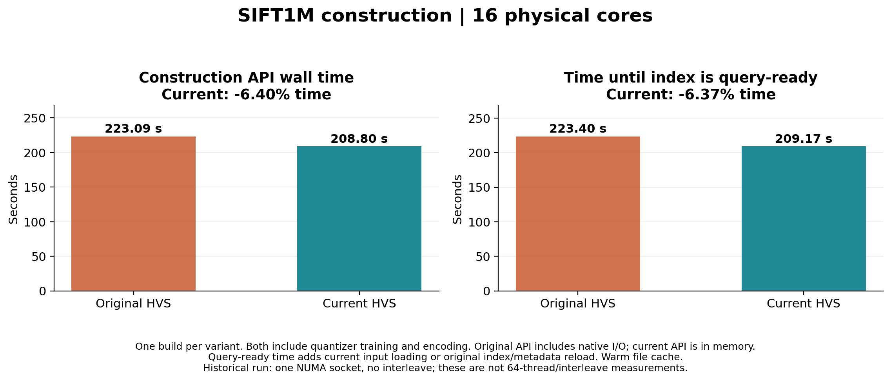
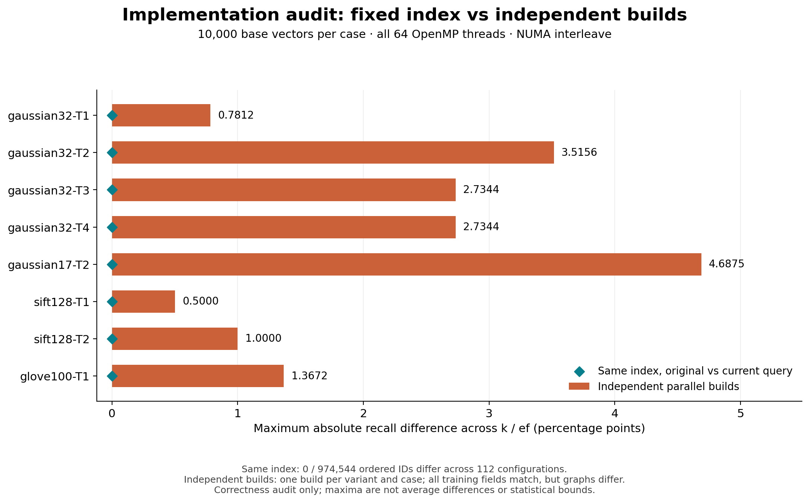

# HVS

HVS: Hierarchical Graph Structure Based on Voronoi Diagrams for Solving Approximate Nearest Neighbor Search

This fork of [Kejing-Lu/hvs](https://github.com/Kejing-Lu/hvs) provides an
in-memory library interface and reproducible source dependencies for
[artea-benchmark](https://github.com/NTU-Siqiang-Group/artea-benchmark).

## Implementation validation and performance

The measurements below compare this fork's implementation at
[`33de94f`](https://github.com/WittenYeh/hvs/commit/33de94f523fa46fc8703411148b50fc89ada3f8c)
with upstream
[`f554268`](https://github.com/Kejing-Lu/hvs/commit/f554268f8c6abcbc23ab35c3562703d7df8ae7b5)
on 2026-09-21. Later documentation and result-publication commits do not change
the measured algorithm sources. Reports, plotting scripts, measurements and
raw logs are checked into [results/](results/).

### Full SIFT1M performance

This comparison uses all **1,000,000 base vectors and 10,000 queries**, 128
dimensions, T=1, M=16, efConstruction=500, delta=0.5, 10,000 training samples,
and seed=100. Both variants use GCC 14.3, the same `-O3` flags and the same
pinned OpenCV/Eigen/zlib libraries. Each variant builds one index.

**These are historical measurements with 16 physical build cores on one NUMA
socket, 1/16 query threads, and no NUMA interleave.** They predate the current
test policy of using all available OpenMP threads (`nproc`) and
`numactl --interleave=all`. The separate correctness audit below follows that
policy; these performance plots have not been relabeled as 64-thread results.
OpenCV uses one internal thread in both experiments to keep the numerical
backend consistent.

| Measurement | Original HVS | This fork | Observed difference |
| --- | ---: | ---: | ---: |
| Construction API time | 223.089 s | 208.801 s | 6.40% less time |
| Time until index is query-ready | 223.402 s | 209.170 s | 6.37% less time |
| Largest absolute Recall@k difference at matching k/ef | — | — | 0.1000 percentage points |
| Single-thread QPS change across 33 matching k/ef settings | — | — | -0.14% to +7.24% |
| 16-thread QPS change across the same settings | — | — | -13.29% to +3.92% |

Recall is the ID-set intersection with the true top-k neighbors, divided by k.
Both query timers include rotation, distance tables, routing and graph search.
The upstream concurrent-query measurements use an adapter calling the original
query functions with per-worker scratch; the upstream demo itself queries
serially. These results show closely matched recall and lower observed build
time, with mixed concurrent throughput. One build and one timing sample per
configuration do not establish statistical equivalence or a universal speedup.



The next plot shows **this fork minus upstream** at every matching k/ef setting;
the y-axis is in percentage points. Each variant's recall is identical between
its 1-thread and 16-thread queries, so one curve per k is sufficient.



Construction includes **PCA/OPQ and codebook training, full-vector quantization,
all graph layers, and routing preparation**. The original API also performs its
native file reads/writes; this fork constructs in memory. Query-ready time adds
this fork's input loading or upstream's index/metadata reload, with the file
cache warmed for both. These are integration timings that include the I/O
difference, rather than isolated graph-building kernel timings.



See the [performance report](results/REPORT.md) and
[methodology and timing boundaries](results/README.md) for the full tables.
The plotted data are available as CSV:
[recall/QPS](results/recall_vs_qps.csv),
[recall differences](results/recall_difference.csv), and
[build times](results/build_times.csv). PNG, PDF and SVG exports are in
[results/](results/).

### Implementation equivalence audit

The later audit uses **all 64 available OpenMP threads and NUMA interleave**,
with eight cases of 10,000 base vectors: Gaussian32 T=1/2/3/4, Gaussian17 T=2,
SIFT128 T=1/2, and GloVe100 T=1. It establishes two distinct observations:

- **Same index, different query implementations:** all 974,544 ordered result
  IDs match across 112 configurations. Repeated queries after non-monotonic
  queue-size changes also match, checking scratch reuse.
- **Independently constructed parallel indexes:** rotation, codebooks and
  merge tables match exactly in all eight cases, while graph structures and
  some results differ. The maximum absolute recall difference is 4.6875
  percentage points on Gaussian17 T=2 at k=1, ef=1. On the 10,000-vector SIFT
  subsets, the maxima are 0.5 points for T=1 and 1.0 point for T=2.



The audit preserves the core algorithm and query behavior on the tested fixed
indexes, but does not prove identical independent parallel builds or equivalence
for every input. Parallel insertion and an inherited shared-RNG synchronization
issue prevent deterministic-build guarantees. Default seeds, compiler/backend
choices, parameter validation and initialization of previously undefined
upstream sort fields also need to be controlled or accounted for.

The [implementation audit report](results/implementation-audit/REPORT.md)
documents the source comparison, differences and limitations. Its
[methodology](results/implementation-audit/README.md) and
[per-configuration results](results/implementation-audit/audit-results.json)
are available alongside the logs. This audit measures correctness; its process
wall times are not used as performance evidence.

## Getting Started

### Prerequisites

* Linux on x86-64, with a C/C++17 compiler supporting OpenMP
* CMake 3.24+
* Git, including recursively initialized submodules

OpenCV Core 4.5.4, Eigen 3.4.0 and zlib 1.3.2 are pinned Git submodules under `third-party/`.
CMake builds static libraries from these sources inside the build directory.
No system OpenCV, TBB, IPP, GUI libraries, or privileged installation is needed.
See [third-party/README.md](third-party/README.md) for dependency scope and build
details. OpenMP and the C/C++ runtimes come from the compiler toolchain.

### Datasets and query sets

* Tiny80M (https://drive.google.com/file/d/1PzW9cqi8VbzH9Bu_7UDWAXjA2DlBorG3/view?usp=sharing)
* Other real datasets (https://www.cse.cuhk.edu.hk/systems/hash/gqr/datasets.html)

### Compile on Linux

```shell
git clone --recurse-submodules git@github.com:WittenYeh/hvs.git
cd hvs
cmake -S . -B build -DCMAKE_BUILD_TYPE=Release
cmake --build build -j8
```

For an existing checkout, run `git submodule update --init --recursive` first.
HVS has one project-owned `CMakeLists.txt`, at the repository root. Dependency
submodules retain their own upstream build files. The demo is `build/main`.

To embed HVS, use `add_subdirectory(path/to/hvs)` and link `HVS::hvs`. Public
headers require C++17; OpenCV headers remain private to the implementation.
The first build compiles the pinned dependencies; subsequent builds reuse them.
## Commands

The benchmark integration also provides a standalone `HVS::hvs` CMake target
and `hnsw/hvs.hpp`. It builds an index in memory and searches it without accessing
index files:

```cpp
hvs::BuildConfig config;
hvs::Index index(base, num_vectors, dim, config);
const auto queue = std::min(std::size_t(100), index.max_search_queue());
hvs::Index::QueryScratch scratch(index, queue);
index.search(query, topk, queue, ids, scratch);
```

Use one scratch object per query worker, with `0 < topk <= queue`. The library
copies input vectors during construction. `quantizer.cpp` contains the training
routines extracted from the original demo; both entry points share those
implementations. Training retains the original initialization, iteration counts,
merging and representative-selection rules, while using scoped OpenCV storage,
partial candidate sorting, reusable query buffers and parallel routing cells.
The graph releases its own quantized layers and can finish construction without
serializing the original-vector graph.

The original file-based demo below is built when `HVS_BUILD_DEMO=ON` (the default
for a standalone build). It is disabled by default when included as a subdirectory.

* `K` is the value of top-K, `L` is the value of efsearch and `qn` is the size of query set
* `T` and `delta` are user-specified parameters of HVS
* The data set, query set and the ground_truth set are stored in dPath.ds, qPath.q and truth.gt

Build HVS index
```shell
./build/main ${dPath}.ds nullptr ${n} ${d} ${T} -1 ${delta} -1
```
Search in HVS
```shell
./build/main ${dPath}.ds ${qPath}.q ${n} ${d} ${T} ${qn} ${K} ${L}
```

## A running example (ImageNet)
* Donwload the dataset, query set and the ground truth set of ImageNet from the following link
https://drive.google.com/file/d/1WV78sZT1j1oz-GoZTQdyKaNQgulRLe2O/view?usp=sharing
* Put all three files in the main folder
* Run the script
```shell
bash run_image.sh
```
